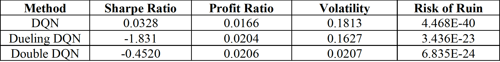

# DeepRLTrade
This project uses Stable Baselines to compare performance of different Deep Reinforcement Learning algorithms (DQN, Dueling DQN, Double DQN) to trade AAPL stocks over a 90 day period. Served as a final project for a graudate course on data-driven methods. 

# Results
Observing the table below, the Sharpe ratio of DQN is the highest — typically a good Sharpe ratio is greater than 1.0, which suggests the portfolio offers good returns given its volatility. Dueling DQN and Double DQN have negative ratios, which suggests the return is expected to be negative. This is interesting as the latter two have lower volatilities than DQN, yet the risk of ruin is orders of magnitude higher in comparison to DQN. While the risk of ruin metrics are extremely small non-zero numbers, DQN has an extremely low value — this suggests that while all three algorithms have <1% chance of losing substantial amounts from the investment, DQN has the lowest chance of that happening. The profit ratio is highest for Double DQN, meaning that this algorithm has a slightly higher ability to earn profits compared to the other two methods. While this is not apparent from the given Sharpe ratios, perhaps if the time period was longer than 90 days the results would differ.

Future considerations to strengthen this bot could involve quantizing more data for the bot to make better decisions. For example, Natural Language Processing on Twitter tweets could provide additional signals for the bot to make profit (akin to an autonomous robot needing more sensors to create a more accurate position via Kalman Filtering). Another consideration would be to use the price of a related stock to act as a signal for the primary stock — an example of this is monitoring the stock price of AMD and AAPL. AMD products are used in Apple, so it could be determined if there is a positive correlation between the two; if so, the former can act as a signal for the latter. A final consideration for this project would be to adjust the training parameters Alpha and Gamma, as changing them can drastically alter results.

# References
Brunton, S. L., & Jutz, N. J. (2020). Data-Driven Science and Engineering: Machine Learning, Dynamical Systems and Control. Cambridge University Press.
Dixon, M., Halperin, I., & Bilokon, P. (2020). Machine Learning for Finance: From Theory to Practice. Springer.

Renotte, N. (2021, March 15). Reinforcement-learning-for-trading. GitHub. Retrieved May 3, 2022, from https://github.com/nicknochnack/Reinforcement-Learning-for-Trading/blob/main/Reinforcement%20Learning%20GME%20Trading%20Tutorial.ipynb

Yahoo! (2022, May 4). Apple Inc. (AAPL) stock price, news, Quote & History. Yahoo! Finance. Retrieved May 3, 2022, from https://finance.yahoo.com/quote/AAPL/

Yang, B. (2021, October 26). Deep Reinforcement Learning for Automated Stock Trading. Medium. Retrieved May 3, 2022, from https://towardsdatascience.com/deep-reinforcement-learning-for-automated-stock-trading-f1dad0126a02

